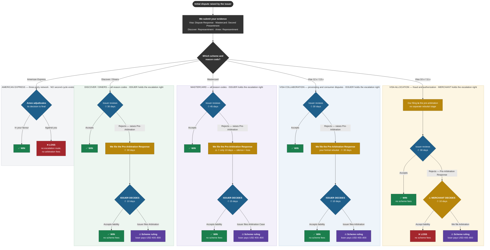
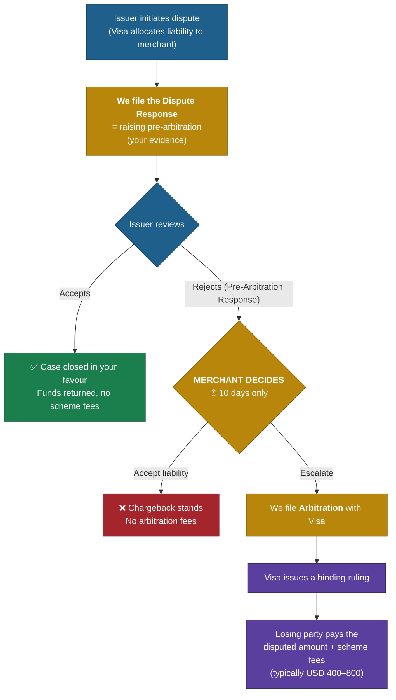
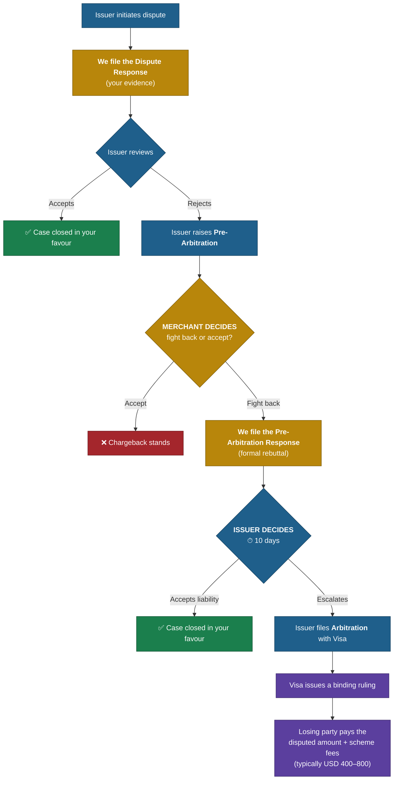
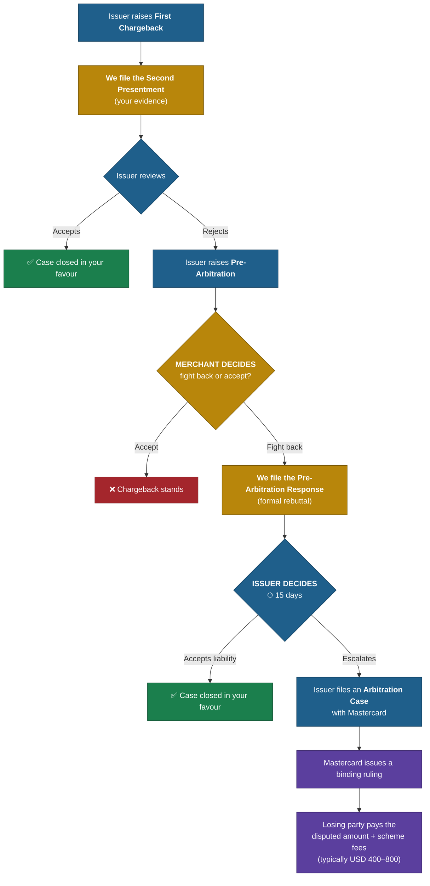
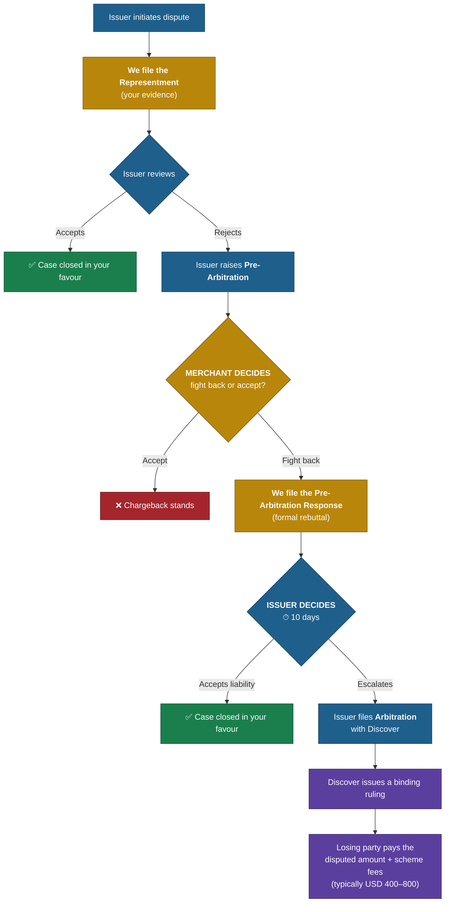
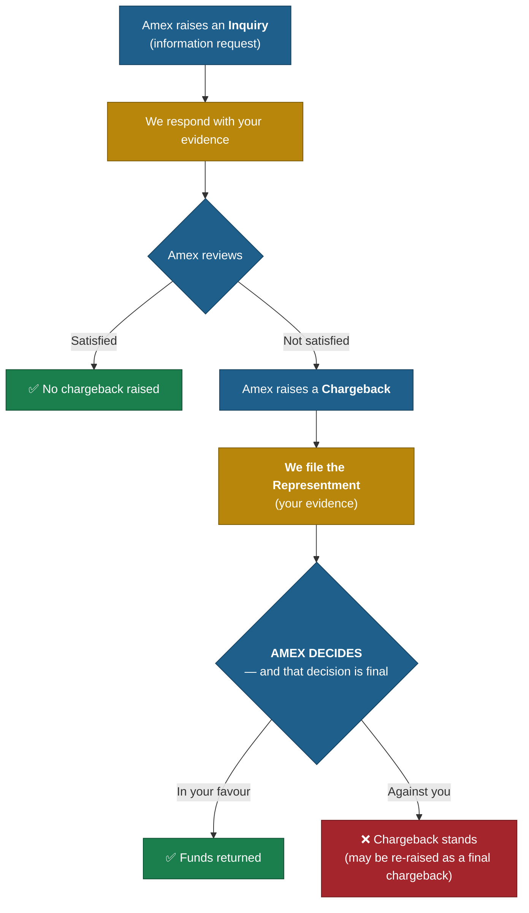
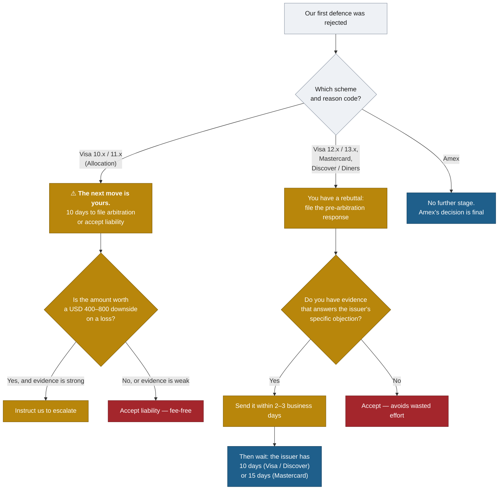

# Life After the First Dispute Outcome: Pre-Arbitration & Arbitration by Scheme

**A merchant guide to the second dispute cycle**

---

## 1. Why this document exists

Most merchants understand the first round of a dispute: a chargeback arrives, you send
evidence, you win or you lose. What is far less well understood is what happens *after*
that first outcome — the **second dispute cycle**, made up of **pre-arbitration** and
**arbitration**.

This is where a large share of recoverable revenue is won or lost, for three reasons:

1. **The clocks are short.** The windows in cycle two are measured in 10–15 days, not 30–45.
2. **The action owner changes depending on the scheme and the dispute reason.** In most flows
   the *issuer* decides whether to escalate. In **Visa Allocation (fraud and authorization)
   disputes, the decision sits with you and your acquirer** — and you get only 10 days.
3. **Arbitration has a price tag.** The losing side pays the scheme's filing and review fees
   (typically **USD 400–800**, in addition to the disputed amount), so the final step is a
   commercial decision, not just an evidence decision.

Read section 2 for the plain-English version. Use sections 4–9 when you need the exact flow
for a specific scheme.

---

## 2. The one-minute summary

### 2a. Visa Collaboration, Mastercard, Discover / Diners

> 1. **Initial chargeback** — the cardholder's issuing bank initiates the dispute.
> 2. **Our representment** — we challenge the dispute with your evidence.
> 3. **Issuer rejection** — the issuing bank rejects the evidence, in what is called the
>    **"pre-arbitration"** stage.
> 4. **Formal rebuttal** — we formally escalate and challenge their rejection
>    (the **"pre-arbitration response"**).
> 5. **Final resolution** — the issuing bank must then either accept liability or take the
>    case to formal **arbitration** with the card scheme (e.g. Visa), where the losing party
>    incurs a fee (typically USD 400–800).

### 2b. Visa Allocation (fraud and authorization disputes)

> 1. **Initial chargeback** — the cardholder's issuing bank initiates the dispute.
> 2. **Our representment** — we challenge the dispute with your evidence, in what is called
>    raising the **"pre-arbitration"**.
> 3. **Issuer rejection** — the issuing bank rejects the evidence, in what is called the
>    **"pre-arbitration response"**.
> 4. **Final resolution** — the **merchant** must then either accept liability or take the
>    case to formal **arbitration** with the card scheme, where the losing party incurs a fee
>    (typically USD 400–800).

**The single most important difference:** in Allocation there is no "formal rebuttal" step
for you, because your pre-arbitration *was* the rebuttal. Once the issuer rejects it, the next
move is yours — escalate to arbitration or accept liability.

---

## 3. Who holds the next move — at a glance

### 3a. The decision owner, by scheme

| Scheme / flow | Dispute reasons covered | Who raises pre-arbitration | Who responds to it | **Who decides on arbitration** | Escalation window |
|---|---|---|---|---|---|
| **Visa — Allocation** | Fraud (10.x), Authorization (11.x) | **Merchant / acquirer** (this *is* the dispute response) | Issuer | **Merchant / acquirer** | **10 days** from issuer's rejection |
| **Visa — Collaboration** | Processing errors (12.x), Consumer disputes (13.x) | Issuer (after rejecting our dispute response) | **Merchant / acquirer** | Issuer | **10 days** from our pre-arb response |
| **Mastercard** | All reason codes | Issuer (after rejecting our second presentment) | **Merchant / acquirer** | Issuer | **15 days** from our pre-arb response |
| **Discover / Diners** | All reason codes | Issuer (after rejecting our representment) | **Merchant / acquirer** | Issuer | **10 days** from our pre-arb response |
| **American Express** | All reason codes | *n/a — no pre-arbitration / arbitration cycle* | *n/a* | **Amex itself adjudicates** | *n/a* |

**Rule of thumb:** *Allocation is the only flow where the ball ends up in the merchant's court.
Everywhere else, after our rebuttal, we wait on the issuer.*

### 3b. The complete map

Every path that can follow an initial dispute outcome, across all five scheme flows. Gold nodes are
the points where **you** must act; blue nodes are where the **issuer** acts. Visa Allocation is the
only lane whose final escalation decision is gold.

> A rendered, print-ready version of this map and of every per-scheme diagram below is in
> [`dispute-flow-diagrams.html`](./dispute-flow-diagrams.html) — open it in a browser, or print it
> to PDF to send on.

---

## 4. Terminology decoder

The same four things are called different names in each scheme. This table is the Rosetta
Stone for everything that follows.

| What is actually happening | Visa Allocation | Visa Collaboration | Mastercard | Discover / Diners |
|---|---|---|---|---|
| Issuer opens the dispute | Dispute | Dispute | First chargeback | Dispute / chargeback |
| We challenge it with your evidence | **Dispute response** (filed *as* a pre-arbitration) | **Dispute response** | **Second presentment** | **Representment / dispute response** |
| Issuer refuses to accept our evidence | **Pre-arbitration response** | **Pre-arbitration** | **Pre-arbitration (pre-arb case)** | **Pre-arbitration** |
| We formally rebut that refusal | *(no separate step)* | **Pre-arbitration response** | **Pre-arbitration response** | **Pre-arbitration response** |
| Scheme makes a binding ruling | **Arbitration** | **Arbitration** | **Arbitration case** | **Arbitration / dispute resolution** |

> **Watch out:** "pre-arbitration" means the *opposite direction of travel* in Visa Allocation
> versus every other flow. In Allocation **we** raise it; elsewhere the **issuer** raises it.
> This is the single biggest source of confusion when reading dispute case notes.

---

## 5. Visa — Allocation (fraud & authorization disputes)

Applies to Visa reason codes **10.x (fraud)** and **11.x (authorization)**. Visa *allocates*
liability up front based on data it already holds, which is why your evidence enters the flow
as a pre-arbitration rather than as a plain response.

### Flow

### Stage-by-stage

| # | Stage | Scheme name | Who acts | Indicative window | If no action is taken |
|---|---|---|---|---|---|
| 1 | Dispute raised | Dispute | Issuer | — | — |
| 2 | Evidence submitted | Dispute response (pre-arbitration) | **Merchant → Checkout → acquirer** | 30 days from dispute | Dispute stands; liability is yours |
| 3 | Issuer verdict | Pre-arbitration response | Issuer | 30 days | Treated as accepted in your favour |
| 4 | **Escalation decision** | Arbitration filing | **Merchant / acquirer** | **10 days from rejection** | Case closes against you; no fees |
| 5 | Binding ruling | Arbitration decision | Visa | Varies (typically weeks) | — |

### What this means for you

- **Step 4 is the one to diarise.** Ten days is the entire window, and it includes the time
  Checkout needs to prepare and file. Please aim to give us your instruction and any final
  supporting evidence **within 3–4 business days** of us notifying you of the rejection.
- You cannot add fundamentally new arguments at arbitration — Visa rules on the case as
  constructed. **Front-load your strongest evidence at step 2.**
- If the economics don't justify it (low ticket value versus a USD 400–800 downside), accepting
  liability at step 4 is a legitimate, fee-free outcome.

---

## 6. Visa — Collaboration (processing errors & consumer disputes)

Applies to Visa reason codes **12.x (processing errors)** and **13.x (consumer disputes)**. Here
the two sides *collaborate* through a conventional back-and-forth, and the issuer keeps the
escalation right.

### Flow

### Stage-by-stage

| # | Stage | Scheme name | Who acts | Indicative window | If no action is taken |
|---|---|---|---|---|---|
| 1 | Dispute raised | Dispute | Issuer | — | — |
| 2 | Evidence submitted | Dispute response | **Merchant → Checkout → acquirer** | 30 days from dispute | Dispute stands; liability is yours |
| 3 | Issuer rejects | Pre-arbitration | Issuer | 30 days | Case closes in your favour |
| 4 | Formal rebuttal | **Pre-arbitration response** | **Merchant → Checkout → acquirer** | 30 days from pre-arb | Pre-arb is deemed accepted; you lose |
| 5 | **Escalation decision** | Arbitration filing | Issuer | **10 days from our response** | Case closes in your favour |
| 6 | Binding ruling | Arbitration decision | Visa | Varies | — |

### What this means for you

- **Step 4 is your last chance to put evidence on the record.** Treat it as a second, stronger
  representment, not a formality.
- After step 4 you are waiting. **Most issuers do not escalate** — filing arbitration exposes
  them to the same fee risk, so a well-argued pre-arbitration response very often ends the case.
- If the issuer does escalate, no further evidence is requested from you; Visa rules on the file.

---

## 7. Mastercard

The sequence is identical in shape to Visa Collaboration. Only the **wording** and the **final
escalation window** differ.

### Flow

### Stage-by-stage

| # | Stage | Scheme name | Who acts | Indicative window | If no action is taken |
|---|---|---|---|---|---|
| 1 | Dispute raised | First chargeback | Issuer | — | — |
| 2 | Evidence submitted | **Second presentment** | **Merchant → Checkout → acquirer** | 45 days from chargeback | Chargeback stands; liability is yours |
| 3 | Issuer rejects | **Pre-arbitration** | Issuer | 45 days from second presentment | Case closes in your favour |
| 4 | Formal rebuttal | **Pre-arbitration response** | **Merchant → Checkout → acquirer** | **10 days from pre-arb** — the tightest merchant-side clock in the Mastercard flow | Pre-arb is deemed accepted; you lose |
| 5 | **Escalation decision** | Arbitration case filing | Issuer | **15 days from our response** | Case closes in your favour |
| 6 | Binding ruling | Arbitration decision | Mastercard | Varies | — |

### What this means for you

- **Mastercard's merchant-side rebuttal window at step 4 is short.** Silence is read as
  agreement, so an unanswered pre-arbitration is an automatic loss. If you want to defend,
  tell us quickly — ideally within **2–3 business days** of our notification.
- The issuer then gets **15 days** (rather than Visa's 10) to decide on arbitration, so expect
  a slightly longer wait before the case closes.
- Mastercard requires the issuer to attempt pre-arbitration *before* arbitration. That is good
  news for you: it guarantees you a rebuttal opportunity you can use.

---

## 8. Discover / Diners Club

Discover (which also operates Diners Club) follows the same structure as Visa Collaboration,
including the **10-day** issuer escalation window. Discover acts as both network and, for many
cards, the issuer — so the "issuer" in the flow below may be Discover itself.

### Flow

### Stage-by-stage

| # | Stage | Scheme name | Who acts | Indicative window | If no action is taken |
|---|---|---|---|---|---|
| 1 | Dispute raised | Dispute / chargeback | Issuer | — | — |
| 2 | Evidence submitted | Representment / dispute response | **Merchant → Checkout → acquirer** | 30 days from dispute | Dispute stands; liability is yours |
| 3 | Issuer rejects | Pre-arbitration | Issuer | 30 days | Case closes in your favour |
| 4 | Formal rebuttal | Pre-arbitration response | **Merchant → Checkout → acquirer** | 30 days from pre-arb | Pre-arb is deemed accepted; you lose |
| 5 | **Escalation decision** | Arbitration filing | Issuer | **10 days from our response** | Case closes in your favour |
| 6 | Binding ruling | Arbitration decision | Discover | Varies | — |

---

## 9. American Express (and other networks)

### American Express

Amex is a **three-party network**: it is the network *and* the issuer. There is therefore **no
pre-arbitration and no arbitration cycle** — no third party exists to arbitrate between.

| Stage | Who acts | Notes |
|---|---|---|
| Inquiry | **Merchant** | Answer it. A good inquiry response often prevents the chargeback entirely. |
| Chargeback | Amex | — |
| Representment | **Merchant → Checkout** | Typically 20 days. Your one substantive defence. |
| Final decision | Amex | **No escalation route, no arbitration fees.** |

**Practical consequence:** with Amex, everything rides on the quality of your first response.
There is no second cycle to fall back on.

### JCB, UnionPay and other networks

These generally follow a two-cycle structure broadly similar to Visa Collaboration (dispute →
representment → pre-arbitration/second chargeback → arbitration), but volumes are low and the
rules vary by region and acquiring arrangement. **If you receive one of these, raise it with your
Checkout contact and we will confirm the exact applicable windows case by case** rather than
assume the Visa/Mastercard timings apply.

---

## 10. Master comparison

| | **Visa Allocation** | **Visa Collaboration** | **Mastercard** | **Discover / Diners** | **Amex** |
|---|---|---|---|---|---|
| Dispute reasons | Fraud 10.x, Auth 11.x | Processing 12.x, Consumer 13.x | All | All | All |
| Our first defence is called | Dispute response (= pre-arb) | Dispute response | Second presentment | Representment | Representment |
| Issuer's rejection is called | Pre-arbitration response | Pre-arbitration | Pre-arbitration | Pre-arbitration | *n/a* |
| Do we get a formal rebuttal? | ❌ No separate step | ✅ Pre-arb response | ✅ Pre-arb response | ✅ Pre-arb response | ❌ |
| **Who can escalate to arbitration** | **Merchant / acquirer** | Issuer | Issuer | Issuer | *Nobody* |
| **Escalation window** | **10 days** | **10 days** | **15 days** | **10 days** | *n/a* |
| Number of merchant evidence submissions | 1 | 2 | 2 | 2 | 1 (+ inquiry) |
| Losing-party fee exposure | ✅ USD ~400–800 | ✅ USD ~400–800 | ✅ USD ~400–800 | ✅ USD ~400–800 | ❌ None |
| Ruling is final & binding | ✅ | ✅ | ✅ | ✅ | ✅ (Amex's own) |

---

## 11. The economics of arbitration

Arbitration is the only stage of the dispute lifecycle where **losing costs you more than the
transaction**. Before escalating — or before deciding how hard to fight a pre-arbitration —
weigh these up:

| Factor | Why it matters |
|---|---|
| **Disputed amount** | Below roughly USD 500–1,000, a USD 400–800 fee can exceed the value of winning. High-ticket cases are where arbitration pays. |
| **Strength of evidence** | Arbitration is decided on the written file against the scheme's rulebook, not on fairness. A clear rule breach by the issuer is a strong case; "the customer is being unreasonable" is not. |
| **Scheme rule compliance** | If your original transaction had a technical defect (missing 3DS, wrong MCC, late presentment), you are likely to lose regardless of the commercial merits. |
| **Precedent value** | A pattern of identical disputes from one issuer or one product line can justify escalating one case to establish a position. |
| **Who pays** | The **losing party** pays the scheme's filing and review fees. Fee levels are set by each scheme and change periodically — we will confirm the current figure for your case before filing. |

**The pre-arbitration stage is where most cases are actually won.** Accepting at pre-arbitration
is free for the issuer, so a rebuttal that makes their arbitration case look weak is often
enough to close the matter without anyone paying a fee. Put your effort there.

---

## 12. What we need from you, and when

| Trigger | What we need | Target turnaround |
|---|---|---|
| Dispute / chargeback notification | Full evidence pack (see below) | Within 7 calendar days |
| Pre-arbitration received (Visa Collaboration, Mastercard, Discover) | Your decision to defend, plus any new evidence | **2–3 business days** (Mastercard is tightest) |
| Pre-arbitration response rejected (**Visa Allocation only**) | Your instruction to file arbitration or accept liability | **3–4 business days** — the total window is 10 days |
| Arbitration filed by either side | Nothing further — the file is closed to new evidence | — |

### Evidence pack checklist

- Transaction record: amount, date, currency, authorization code, ARN
- Authentication data: 3DS result, AVS/CVV match, device and IP data
- Proof of delivery or service: tracking, signature, download/access logs, usage timestamps
- Customer records: account history, previous undisputed orders, login history
- Communications: emails, chat logs, support tickets, cancellation or refund correspondence
- Your terms: T&Cs accepted at checkout, refund/cancellation policy, subscription consent
- For subscriptions: sign-up record, billing schedule disclosure, cancellation path evidence

**Unresponded means lost.** Across every scheme except Amex, failing to answer within the window
is treated as accepting liability. A fast "no, we won't defend this one" is better than silence.

---

## 13. Quick decision guide

---

## 14. Glossary

| Term | Meaning |
|---|---|
| **Allocation** | Visa's flow for fraud and authorization disputes, where Visa assigns liability up front from data it already holds. |
| **Arbitration** | The scheme's binding ruling on a dispute, with the losing party paying the scheme's fees. |
| **Collaboration** | Visa's flow for processing-error and consumer disputes, resolved by evidence exchange between the parties. |
| **First chargeback** | Mastercard's term for the issuer's initial dispute. |
| **Pre-arbitration** | A formal pre-escalation step. In Visa Allocation it is *our* evidence filing; in every other flow it is the *issuer's* rejection of our evidence. |
| **Pre-arbitration response** | The reply to a pre-arbitration. In Visa Allocation this is the *issuer's* rejection; elsewhere it is *our* formal rebuttal. |
| **Representment / dispute response** | Our submission of your evidence against the initial dispute. |
| **Second presentment** | Mastercard's term for the representment. |
| **ARN** | Acquirer Reference Number — the unique identifier used to trace a transaction through a dispute. |

---

## 15. Important notes on this document

- **Timeframes are the operative windows in our dispute-handling process and reflect current
  scheme rules.** Card schemes revise their rulebooks (Visa and Mastercard typically twice a
  year), and some windows vary by region, reason code, and acquiring arrangement. Where a case
  is close to a deadline we will always confirm the exact date that applies.
- **Fee figures are indicative.** The USD 400–800 range covers typical scheme filing and review
  fees for the losing party. Current amounts are set by each scheme and will be confirmed before
  any arbitration filing.
- **All windows are calendar days unless stated otherwise**, and they run from the scheme's
  processing date — not from the date we notify you. This is why our internal turnaround targets
  in section 12 are shorter than the scheme windows.
- Please raise any case-specific questions with your Checkout account or disputes contact.

